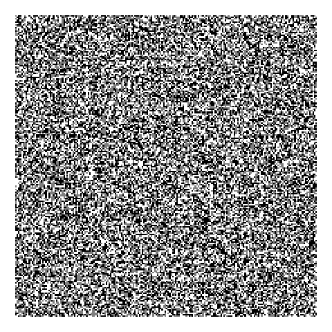

<!-- README.md is generated from README.Rmd. Please edit that file -->

```{r, include = FALSE}
knitr::opts_chunk$set(
  collapse = TRUE,
  comment = "#>",
  fig.path = "man/figures/README-",
  echo = FALSE
)
```
# mrf2d

<!-- badges: start -->
[](https://travis-ci.org/Freguglia/mrf2d)
<!-- badges: end -->

Markov Random Fields are probabilistic models capable of describing sets of random variables with a local dependence property (the Markov property) defined on a neighborhood system. Particularly on the context of image processing, pixels can be seen as vertices of a graph defined on a finite 2-dimensional lattice, and a neighborhood system can be defined based on their relative positions to construct a MRF.

<p align="center">

<p>

The goal of `mrf2d` is to provide simple functions for sampling and analysis of Markov Random Fields on 2-dimensional lattices, including Hidden Markov Random Fields. It introduces the S4 class `mrfi` to describe interaction structures in a very general way, being able to adapt from very simple cases like the Ising Model to complex anisotropic models with different types of interaction.
<center>
```{r, fig.show="hold", warning = FALSE, message = FALSE, fig.width=3, fig.height=3}
library(mrf2d)
a <- new("mrfi")
a@Rmat <- cbind(diag(2), c(1,1)); a@n_neis <- 2; a@n_types <- 1

b <- new("mrfi")
b@Rmat <- matrix(c(1,0,0,1,4,4,1,1,1,-1,2,0,0,2), byrow = TRUE, ncol = 2)
b@Rmat <- cbind(b@Rmat, c(1,1,4,2,2,3,3)); a@n_neis <- 5; a@n_types <- 3

plot(a, no_axis = TRUE, no_text = TRUE)
plot(b, no_axis = TRUE)
```
</center>

## Installation
<!--
You can install the released version of mrf2d from [CRAN](https://CRAN.R-project.org) with:

``` r
install.packages("mrf2d")
```
-->
Currently, the package is only available as a development version on Github. It can be installed with the `devtools` package by using

```{r, echo = TRUE, eval=FALSE}
devtools::install_github("Freguglia/mrf2d")
```

The package will be available on CRAN as soon as a reasonable number of features are added and well documented.

## Examples

<!--
Write something about Markov Random Fields 
-->

## Next Steps

I currently have most of the functions implemented already but proper documentation is lacking, features will be added as soon as the documentation is written. For any requests, e.g., implementation of a particular model or method, feel free to file an issue and I can check if it can be implemented within the current framework.

An immediate to-do list:

 * Write an R function wrapper for the `cpp` function `gibbs_sampler_mrf()` and stop exporting the `cpp` function itself.
 * Document the Gibbs Sampler function properly and write some tests.

## Contributing and Bug Reports

If you're interested in contributing or found a bug or error, please file an issue. Contributions can be done in form of code optimization, new ideas, discussing new structures, etc.
