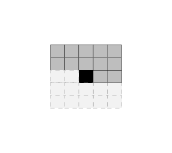
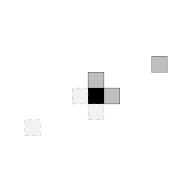
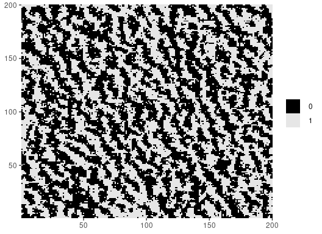

<!-- README.md is generated from README.Rmd. Please edit that file -->

# mrf2d <a href='https://github.com/Freguglia/mrf2d'></a>

<!-- badges: start -->

[](https://travis-ci.org/Freguglia/mrf2d)
[](https://app.codecov.io/gh/Freguglia/mrf2d?branch=master)
[](https://cran.r-project.org/package=mrf2d)
[](https://lifecycle.r-lib.org/articles/stages.html#stable)
<!-- badges: end -->

Markov Random Fields are probabilistic models capable of describing sets
of random variables with a local dependence property (the Markov
property) defined on a neighborhood system. Particularly on the context
of image processing, pixels can be seen as vertices of a graph defined
on a finite 2-dimensional lattice, and a neighborhood system can be
defined based on their relative positions to construct a MRF.


The goal of `mrf2d` is to provide a framework for the analysis of Markov
Random Fields with pairwise interactions on 2-dimensional lattices,
including Hidden Markov Random Fields. It introduces the S4 class `mrfi`
to describe interaction structures in a very general way, being able to
adapt from very simple cases like the Ising Model to complex anisotropic
models with different types of interaction.



A complete paper describing the details of the package and examples is
published in the Journal of Statistical Software and can be found
[here](https://doi.org/10.18637/jss.v101.i08).

-----

## Installation

You can install the stable version of `mrf2d` from
[CRAN](https://CRAN.R-project.org) with:

``` r
install.packages("mrf2d")
```

The development version is available on the package’s [Github
page](https://github.com/Freguglia/mrf2d). It can be installed with the
`devtools` package by using

``` r
devtools::install_github("Freguglia/mrf2d")
```

-----

## Usage

`mrf2d` introduces a programming interface for the general Markov Random
Field model in *Freguglia, Victor, Nancy L. Garcia, and Juliano L.
Bicas. “Hidden Markov random field models applied to color homogeneity
evaluation in dyed textile images.” Environmetrics (2019): e2613.* Using
specific interaction structures and parameter restrictions can lead to
important models as particular cases, such as the Potts model.

It introduces the S4 class `mrfi` to represent interaction structures.
The `mrfi()` function can be used to create these objects representing
interaction structures with relative positions included based on the
norm of the relative position (distance) or explicitly specified

``` r
interact <- mrfi(max_norm = 1, positions = list(c(4,2)))
interact
#> 3 interacting positions.
#>   rx     ry
#>    1      0
#>    0      1
#>    4      2
plot(interact)
```

<!-- -->

Potentials (parameters) are represented by three-dimensional arrays,
where rows and columns represent pixel label values and slices represent
interacting positions.

``` r
potentials <- expand_array(c(-0.9, -0.9, 0.2), family = "oneeach", C = 1, mrfi = interact)
potentials
#> , , (1,0)
#> 
#>      0    1
#> 0  0.0 -0.9
#> 1 -0.9  0.0
#> 
#> , , (0,1)
#> 
#>      0    1
#> 0  0.0 -0.9
#> 1 -0.9  0.0
#> 
#> , , (4,2)
#> 
#>     0   1
#> 0 0.0 0.2
#> 1 0.2 0.0
```

The negative values out of diagonal means different “colors” are less
likely in that relative position.

The package has many built-in functions for sampling, potentials
estimation and hidden MRF model fitting (used for image segmentation),
but it also provides all the basic stack of computations used to
implement algorithms for MRF models, making it suitable for development
of research in Markov Random Field models.

``` r
set.seed(1)
img_dim <- c(200,200)
Z <- rmrf2d(img_dim, mrfi = interact, theta = potentials, cycles = 60)
dplot(Z, legend = TRUE)
```



-----

## Contributing and Bug Reports

If you’re interested in contributing or found a bug or error, please
file an [issue](https://github.com/Freguglia/mrf2d/issues).
Contributions can be done in form of code optimization, new ideas,
discussing new structures, etc.
