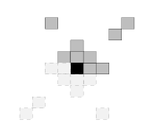
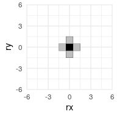

<!-- README.md is generated from README.Rmd. Please edit that file -->

# mrf2d <a href='https://github.com/Freguglia/mrf2d'></a>

<!-- badges: start -->

[](https://travis-ci.org/Freguglia/mrf2d)
[](https://codecov.io/gh/Freguglia/mrf2d?branch=master)
[](https://cran.r-project.org/package=mrf2d)
<!-- badges: end -->

Markov Random Fields are probabilistic models capable of describing sets
of random variables with a local dependence property (the Markov
property) defined on a neighborhood system. Particularly on the context
of image processing, pixels can be seen as vertices of a graph defined
on a finite 2-dimensional lattice, and a neighborhood system can be
defined based on their relative positions to construct a
MRF.


The goal of `mrf2d` is to provide simple functions for sampling and
analysis of Markov Random Fields on 2-dimensional lattices, including
Hidden Markov Random Fields. It introduces the S4 class `mrfi` to
describe interaction structures in a very general way, being able to
adapt from very simple cases like the Ising Model to complex anisotropic
models with different types of
interaction.

<p align="center">



</p>

-----

## Installation

<!--
You can install the released version of mrf2d from [CRAN](https://CRAN.R-project.org) with:

``` r
install.packages("mrf2d")
```
-->

Currently, the package is only available as a development version on
Github. It can be installed with the `devtools` package by using

``` r
devtools::install_github("Freguglia/mrf2d")
```

The package will be available on CRAN as soon as a reasonable number of
features are added and well documented.

-----

## Example

This is an example of what type of analysis you can do with `mrf2d`.
More features are also present, including estimation of parameter in
Markov Random Fields, families of parameter restrictions and more. Read
the package’s
[vignette](https://freguglia.github.io/mrf2d/articles/guide.html) for
more information and detailed description of the functions used:
`browseVignettes("mrf2d")`.

We can define an interaction structure with the `mrfi()` function:

``` r
# We'll include dependence in nearest-neighbors only
int <- mrfi(max_norm = 1)
int
#> 2 interacting positions.
#>   rx     ry
#>    1      0
#>    0      1
plot(int)
```

<!-- -->

We can define a parameter array to sample from a MRF
model:

``` r
# We have 2 interacting positions and we'll use a 3 color model, therefore,
# an array with dimensions (3,3,3) is used.
theta <- mrf2d:::vec_to_array(-1, family = "onepar", C = 2, n_R = 2)
theta
#> , , 1
#> 
#>    0  1  2
#> 0  0 -1 -1
#> 1 -1  0 -1
#> 2 -1 -1  0
#> 
#> , , 2
#> 
#>    0  1  2
#> 0  0 -1 -1
#> 1 -1  0 -1
#> 2 -1 -1  0
```

In short, the negative values out of diagonal means different “colors”
are less likely in that relative position. We can sample from this model
with:

``` r
set.seed(1)
img_dim <- c(200,200)
Z <- rmrf2d(img_dim, mrfi = int, theta = theta, cycles = 60)
dplot(Z, legend = TRUE)
```


We now add a Gaussian error and a linear effect to the image (to create
a hidden Markov Random Field):

``` r
set.seed(1)
Y <- Z + 4 + 0.02*row(Z) + rnorm(length(Z), sd = 0.4)
cplot(Y)
```


We fit a Gaussian hidden Markov random field to recover the components:

``` r
set.seed(3)
fit <- fit_ghm(Y, mrfi = int, theta = theta, 
               fixed_fn = polynomial_2d(c(1,1), dim(Y)), verbose = FALSE)
```

Check the results:

``` r
fit$par
#>         mu    sigma
#> 0 6.010691 0.400807
#> 1 7.011794 0.400807
#> 2 8.013461 0.400807

library(ggplot2)
cplot(fit$fixed) + ggtitle("Linear Effect")
dplot(fit$Z_pred, legend = TRUE) + ggtitle("Predicted Z")
cplot(fit$predicted) + ggtitle("Predicted Value")
```


-----

## Contributing and Bug Reports

If you’re interested in contributing or found a bug or error, please
file an [issue](https://github.com/Freguglia/mrf2d/issues).
Contributions can be done in form of code optimization, new ideas,
discussing new structures, etc.
