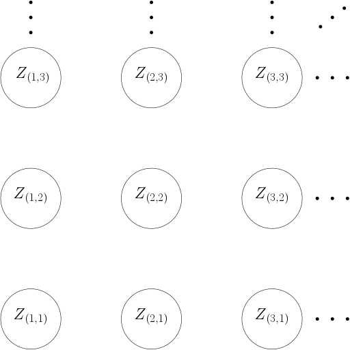

```{r setup, include = FALSE}
knitr::opts_chunk$set(
  collapse = TRUE,
  comment = "#>",
  warning = FALSE,
  message = FALSE,
  fig.align = "center"
)
library(ggplot2)
library(glue)
```

```{r load_mrf2d}
library(mrf2d)
```

# Introduction

 Markov Random Fields are probabilistic models used for modeling processes with local dependence. This dependence can be described by a graph $\mathcal{G} = (\mathcal{V}, \mathcal{N})$, where $\mathcal{V}$ is a set of vertices and $\mathcal{N}$ a neighborhood system. A set of random variables $\mathbf{Z} = \{Z_i, i \in \mathcal{V} \}$ is called a Markov Random Field with respect to the neighborhood system $\mathcal{N}$ if 
 
$$ P(Z_i = z_i | \{ Z_j, j \neq i \}) = P(Z_i| \{ Z_j, j \in \mathcal{N}_i \}), $$
where $\mathcal{N}_i$ denotes the neighbors of $i$ according to $\mathcal{N}$. 

`mrf2d` provides tools for a specific, yet large, class of Markov random field models present in an image processing context: Two-dimensional lattices.

# MRF model for 2-dimensional lattices

The Markov random field model considered in `mrf2d` has the following properties:
 
  * $\mathcal{V}$ is a grid $\mathcal{L} = \{ i =  (i_1, i_2): 1 \leq i_1 \leq N; 1 \leq i_2 \leq M \}$: The data points (called pixels) are indexed by a rectangular lattice $\mathcal{L}$ of dimension $N \times M$. 

<center></center>
  
  * $\mathcal{N}$ is defined by a set of relative positions $\mathcal{R}$: two pixels $i$ and $j$ are connected if and only if their relative position $(i_1, i_2) - (j_1, j_2)$ is in $\mathcal{R}$. As an example, if $\mathcal{R} = \{ (1,0), (0,1) \}$, pixels are connected to their nearest neighbors horizontally and vertically, which can be represented by the structure below. Note the opposite directions have edges but they are not included in $\mathcal{R}$ to avoid redundancy.
  
```{r ex_mrfi, echo = FALSE, out.width="30%"}
plot(mrfi(1), no_axis = TRUE) +  geom_text(aes(label = glue("({rx},{ry})")), size = 6) + xlim(-2,2) + ylim(-2,2)
```

  * $Z_i \in \{ 0,1, \dots, C \}$ for some small integer $C$ and all $i \in \mathcal{L}$.

Under these assumptions, our probability distribution reduces to:

$$ P_\theta(\mathbf{Z} = \mathbf{z}) = \frac{1}{\zeta_\theta} \exp \left( \sum_{i \in \mathcal{L}} \sum_{j = i + r \in \mathcal{L}}^{r \in \mathcal{R}} \theta(z_i, z_j, r) \right), $$

or in terms of co-occurrence counts:

$$ P_\theta(\mathbf{Z} = \mathbf{z}) = \frac{1}{\zeta_\theta} \exp \left( \sum_{r \in \mathcal{R}} \sum_{a,b = 0}^C \theta(a,b,r) n(a,b,r) \right), $$
where $n(a,b,r) = \sum_{i \in \mathcal{L}} \mathbb{1}(z_i = a, z_{i+r} = b)$ is the count of co-occurrences of $a$ and $b$ in relative position $r$.

# The `mrf2d` package

`mrf2d` has the goal to provide tools for analysis of Markov Random Fields on two-dimensional lattices, mainly, by using a simple yet efficient representation of the interaction structure, as well as parameters sets with different types of restrictions. It exports efficient implementations of the most common estimation methods and a sampling function, making it easy to implement new or specific algorithms with little effort taking advantage of the package's API.

Computational efficiency is also an important feature of the package, having most of the computationally intensive functions written in `Rcpp` and object representations designed for high performance.

The package also provides [plotting](https://freguglia.github.io/mrf2d/reference/dplot.html) functions `dplot()` and `cplot()` that automatically convert `matrix` objects to appropriate `data.frame` structures and creates `ggplot` objects from it. These functions aim to provide easy to use methods of visualization but also take advantage of [`ggplot2`](https://ggplot2.tidyverse.org/)'s grammar to modify aesthetics and create elegant and customizable visualizations of lattice data. `dplot()` should be used for **d**iscrete data while `cplot()` is suitable for **c**ontinuous data.

```{r plots_examples, fig.width = 5, fig.height = 3, warning=FALSE}
# Z_potts is a matrix with an example of random field available in the package.
class(Z_potts)
unique(as.vector(Z_potts))

dplot(Z_potts, legend = TRUE)
set.seed(1)
cplot(Z_potts + rnorm(length(Z_potts), sd = 0.6))

# Customizing plots with ggplot2's grammar
library(ggplot2)
dplot(Z_potts, legend = TRUE) + ggtitle("Title added with ggplot2")
dplot(Z_potts, legend = TRUE) + scale_fill_brewer(type = "qual") + 
  ggtitle("Title added with ggplot2")
```


# The `mrfi` class and parameter arrays

The stationary Markov Random Fields described are completely specified by the set of relative positions where interactions exists $\mathcal{R}$ and the interaction parameters $\theta(a,b,r)$.

In `mrf2d`, interaction structures $\mathcal{R}$ are represented by objects of the S4 class `mrfi`, while interaction parameters are represented by simple 3-dimensional arrays, where `theta[a,b,k]` contains the value of $\theta_{a,b,r}$ for the $k$-th relative position. As an example, in a nearest-neighbor structure ($|\mathcal{R}| = 2$) with $C = 1$, where the interaction for equal values ($a=b$) is `0` and `-0.99` for different values, the corresponding array would be

```{r theta_example}
mrf2d:::vec_to_array(-0.99, "onepar", 1, 2)
```

Note that rows represents $a$ values, columns are values of $b$ values and slices are the relative positions in $\mathcal{R}$ .

## Creating `mrfi` objects

`mrfi` objects can be created with the `mrfi()` function. It takes three parameters: `max_norm`, `norm_type` and `positions`. `max_norm` and `norm_type` combined define a region of included interactions. As example, if `max_norm` is `3` and `norm_type` is `"1"`, the interaction structure will include relative positions $r$ where $|r_x| + |r_y| \leq 3$.

Note that opposite positions, e.g., $(1,0)$ and $(-1,0)$ are not both included, as the second one is always redundant for the model. A `plot()` method is available to visualize `mrfi` objects.

```{r}
my_mrfi <- mrfi(max_norm = 3, norm_type = "1")
my_mrfi

plot(my_mrfi)
```

